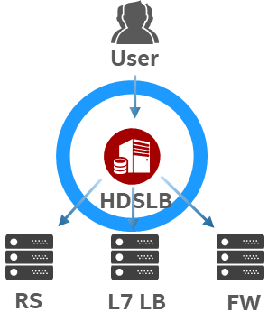
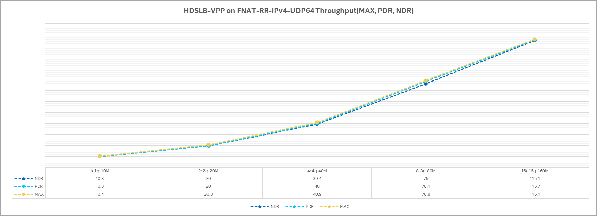
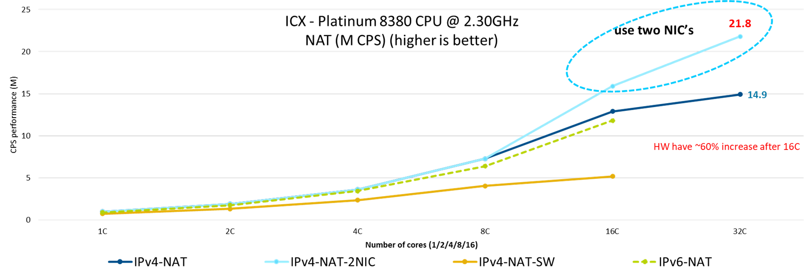

# Introduction

`High-Density Scalable Load Balancer(HDSLB)` is a high performance server-based *Layer-4* load balancer.

HDSLB leverages several key performance optimziation techniques of Intel's hardwares to achieve scalable performance.

HDSLB is based on [DPVS](https://github.com/iqiyi/dpvs).

## Performance

Rough Performance data on recent Intel's Xeon CPU (e.g. 3rd & 4th generation) and NIC (E810 100G) based server：

* Concurrent Session: 100M level / Node
* Throughput: > 8Mpps / Core @FNAT
* TCP Session Est. Rate > 800K / Core
* Linear growth

## Resource

### Manuals

* [Quick Start](./doc/Quick_start.md)

### Whitepaper

* [High Density Scalable Load Balancer - A VPP-Based Layer 4 Load Balancer Technology Guide](https://networkbuilders.intel.com/docs/networkbuilders/high-density-scalable-load-balancer-a-vpp-based-layer-4-load-balancer-technology-guide-1701169184.pdf)
* [Chinese: 火山引擎携手英特尔，基于 HDSLB 优化四层负载均衡性能](https://www.intel.cn/content/dam/www/central-libraries/cn/zh/documents/2023-01/23-22cmf255-volcano-engine-edge-cloud-sees-great-optimazation-in-four-tier-load-balancing-performance-with-hdslb-built-on-intel-hardware-and-software-case-study.pdf)
* [Intel Dynamic Load Balancer Accelerating Elephant Flow](https://networkbuilders.intel.com/solutionslibrary/intel-dynamic-load-balancer-intel-dlb-accelerating-elephant-flow-technology-guide)
* [Chinese: vivo 与英特尔优化 HDSLB 方案，显著改善负载均衡系统性能](https://www.intel.cn/content/www/cn/zh/artificial-intelligence/optimize-hdslb-to-improve-load-balancing-systems.html)
* [Chinese: 是德科技与英特尔携手完成负载均衡单节点2100万连接新建性能测试](https://mp.weixin.qq.com/s/9eLTNXKmYitIFmf2PpTUGQ)

### Community Article

* [Chinese: Intel HDSLB 高性能四层负载均衡器 — 快速入门和应用场景](https://blog.csdn.net/Jmilk/article/details/138751619)
* [Chinese: Intel HDSLB 高性能四层负载均衡器 — 基本原理和部署配置](https://blog.csdn.net/Jmilk/article/details/138752089)
* [Chinese: Intel HDSLB 高性能四层负载均衡器 — 代码剖析和高级特性](https://blog.csdn.net/Jmilk/article/details/138752116)

# License

HDSLB is based on GPL-2.0.

*For commercial use, please contact us to acquire [VPP](https://fd.io/technology/) based HDSLB which is Apache 2.0 License.*

# Contact Us

* Pan Zhang email: `pan1.zhang@intel.com`
